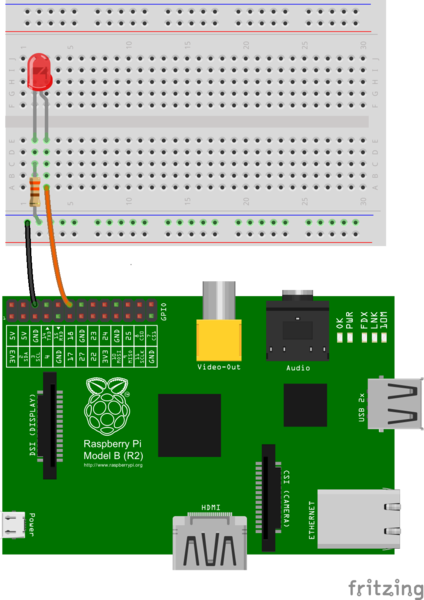

# Raspberry Pi Flask Web Server

Tutorial based on [Matt Richardson](http://mattrichardson.com/Raspberry-Pi-Flask/)

## Simple example

hello-flask.py

    from flask import Flask
    app = Flask(__name__)

    @app.route("/")
    def hello():
    return "Hello World!"

    if __name__ == "__main__":
    app.run(host='0.0.0.0', port=80, debug=True)

and run

    sudo python hello-flask.py

## Simple example with template

Same as above, but variables are now injected into template-file with Jinja2.

hello-flask-template.py

    from flask import Flask, render_template
    import datetime
    app = Flask(__name__)

    @app.route("/")
    def hello():
    now = datetime.datetime.now()
    timeString = now.strftime("%Y-%m-%d %H:%M")
    templateData = {
      'title' : 'HELLO!',
      'time': timeString
      }
    return render_template('main.html', **templateData)

    if __name__ == "__main__":
    app.run(host='0.0.0.0', port=80, debug=True)

templates/main

    <!DOCTYPE html>
       <head>
          <title>{{ title }}</title>
       </head>

       <body>
          <h1>Hello, World!</h1>
          <h2>The date and time on the server is: {{ time }}</h2>
       </body>
    </html>

and run

    sudo python hello-flask-template.py

## Connecting to the real World

### Physical layout

Same as in Led_gpio.md. Simple led an 220 Ohm resistor.

hello-gpio.py

    import RPi.GPIO as GPIO
    from flask import Flask, render_template, request
    app = Flask(__name__)

    GPIO.setmode(GPIO.BCM)

    # Create a dictionary called pins to store the pin number, name, and pin state:
    pins = {
       18 : {'name' : 'led', 'state' : GPIO.LOW},
       }

    # Set each pin as an output and make it low:
    for pin in pins:
       GPIO.setup(pin, GPIO.OUT)
       GPIO.output(pin, GPIO.LOW)

    @app.route("/")
    def main():
       # For each pin, read the pin state and store it in the pins dictionary:
       for pin in pins:
          pins[pin]['state'] = GPIO.input(pin)
       # Put the pin dictionary into the template data dictionary:
       templateData = {
          'pins' : pins
          }
       # Pass the template data into the template main.html and return it to the user
       return render_template('gpio_main.html', **templateData)

    # The function below is executed when someone requests a URL with the pin number and action in it:
    @app.route("/<changePin>/<action>")
    def action(changePin, action):
       # Convert the pin from the URL into an integer:
       changePin = int(changePin)
       # Get the device name for the pin being changed:
       deviceName = pins[changePin]['name']
       # If the action part of the URL is "on," execute the code indented below:
       if action == "on":
          # Set the pin high:
          GPIO.output(changePin, GPIO.HIGH)
          # Save the status message to be passed into the template:
          message = "Turned " + deviceName + " on."
       if action == "off":
          GPIO.output(changePin, GPIO.LOW)
          message = "Turned " + deviceName + " off."
       if action == "toggle":
          # Read the pin and set it to whatever it isn't (that is, toggle it):
          GPIO.output(changePin, not GPIO.input(changePin))
          message = "Toggled " + deviceName + "."

       # For each pin, read the pin state and store it in the pins dictionary:
       for pin in pins:
          pins[pin]['state'] = GPIO.input(pin)

       # Along with the pin dictionary, put the message into the template data dictionary:
       templateData = {
          'message' : message,
          'pins' : pins
       }

       return render_template('gpio_main.html', **templateData)

    if __name__ == "__main__":
       app.run(host='0.0.0.0', port=80, debug=True)

templates/gpoi_main.html

    <!DOCTYPE html>
    <head>
       <title>Current Status</title>
    </head>

    <body>
       <h1>Device Listing and Status</h1>

       
       
The {{ pins[pin].name }}
       
          is currently on (<a href="/{{pin}}/off">turn off</a>)
       
          is currently off (<a href="/{{pin}}/on">turn on</a>)
       
       

       

       
       <h2>{{ message }}</h2>
       

    </body>
    </html>

and run

    sudo python hello-gpio.py
