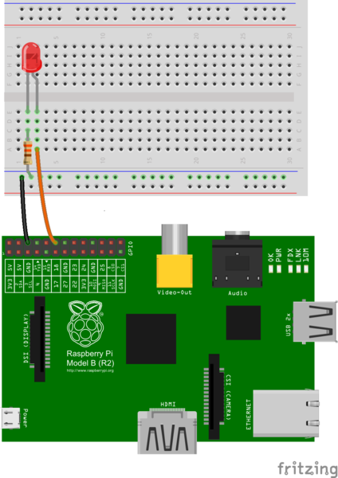

# Raspberry Pi GPIO control (led example)

Based on [raspberry pi tutorials](https://thepihut.com/blogs/raspberry-pi-tutorials/27968772-turning-on-an-led-with-your-raspberry-pis-gpio-pins) and tested on the pi zero.

## Physical pin layout

Use a standard led and 220 Ohm resistor.

The pin layout on the zero is the same as bigger models can be observed here:

## Code implementation

    import RPi.GPIO as GPIO
    import time
    GPIO.setmode(GPIO.BCM)
    GPIO.setwarnings(False)
    GPIO.setup(18,GPIO.OUT)
    print "LED on"
    GPIO.output(18,GPIO.HIGH)
    time.sleep(1)
    print "LED off"
    GPIO.output(18,GPIO.LOW)

and run

    sudo python LED.py
